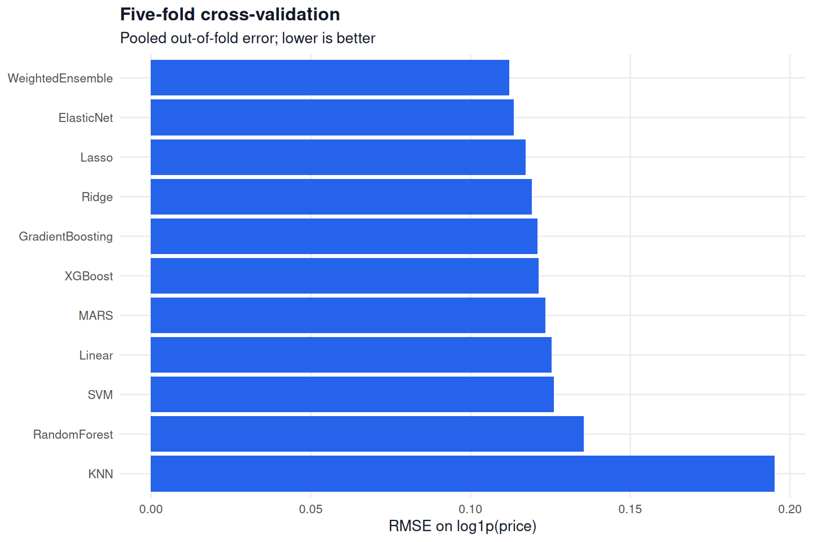
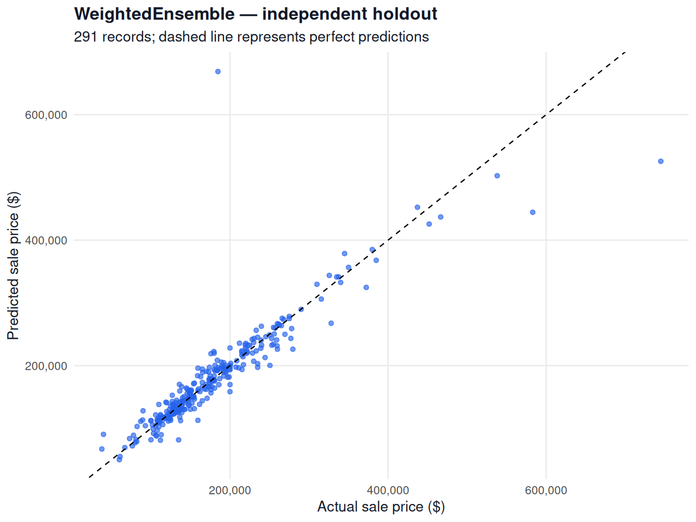
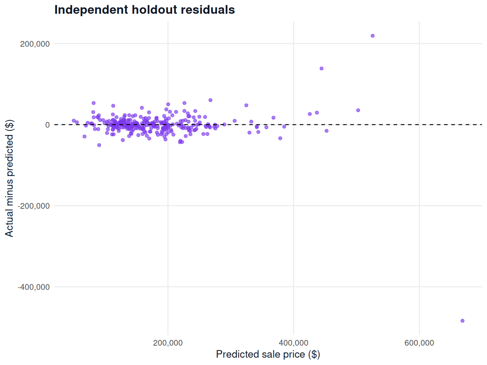
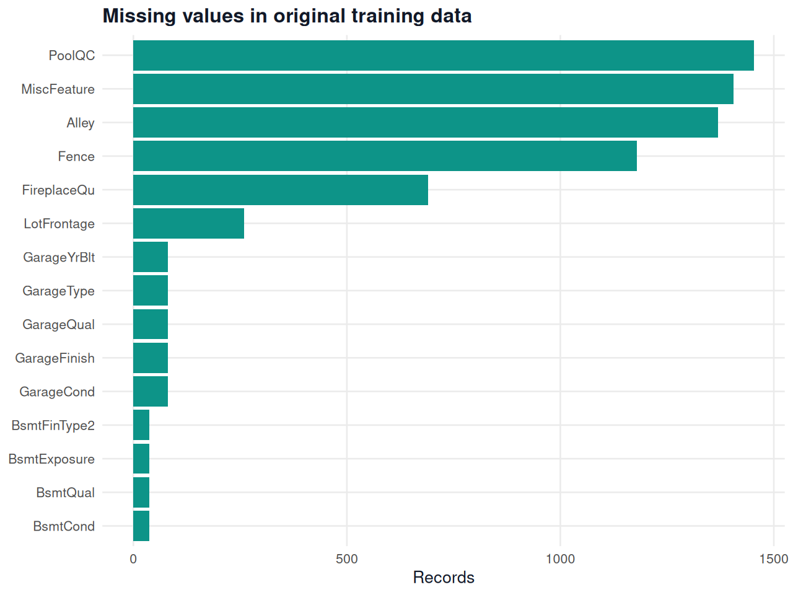
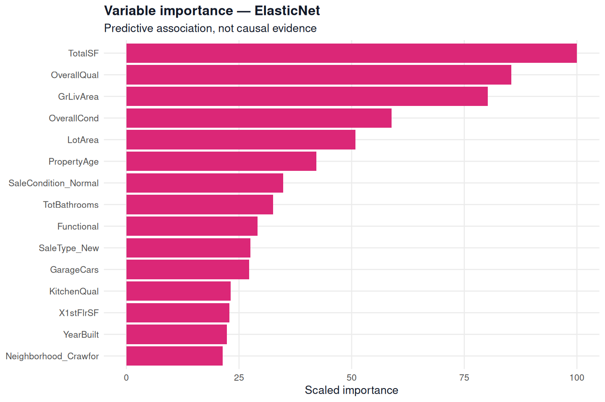

# Verified run results

CV-selected model: WeightedEnsemble
Analysis records: 1168
Holdout records: 291
Training outliers excluded: 1
Test prediction records: 1,459 (unlabeled).

## Cross-validation comparison

These are pooled out-of-fold metrics on the analysis set. Hyperparameter selection also uses those folds; CV scores are selection estimates, not an independent final assessment. Lower RMSE/MAE is better. R2_dollars is a coefficient of determination, not classification accuracy.

| model | RMSE_log | MAE_log | RMSE_dollars | MAE_dollars | R2_dollars |
| --- | --- | --- | --- | --- | --- |
| WeightedEnsemble | 0.1121 | 0.0776 | 21984.50 | 13814.05 | 0.9224 |
| ElasticNet | 0.1136 | 0.0792 | 21778.47 | 14030.02 | 0.9238 |
| Lasso | 0.1172 | 0.0810 | 21924.58 | 14277.77 | 0.9228 |
| Ridge | 0.1193 | 0.0830 | 22697.64 | 14694.20 | 0.9172 |
| GradientBoosting | 0.1210 | 0.0841 | 24722.95 | 15178.26 | 0.9018 |
| XGBoost | 0.1212 | 0.0825 | 23994.85 | 14796.61 | 0.9075 |
| MARS | 0.1235 | 0.0871 | 22806.45 | 15335.16 | 0.9165 |
| Linear | 0.1254 | 0.0862 | 23342.07 | 15176.25 | 0.9125 |
| SVM | 0.1261 | 0.0847 | 24700.14 | 15022.60 | 0.9020 |
| RandomForest | 0.1354 | 0.0917 | 27739.36 | 16667.79 | 0.8764 |
| KNN | 0.1951 | 0.1399 | 41602.96 | 25690.44 | 0.7220 |

## Independent holdout

The model selected by CV achieved log-price RMSE 0.1392, dollar MAE $14,634, dollar RMSE $36,117, and dollar R² 0.8039.

The following table is diagnostic; the holdout scores were not used to choose the final model.

| model | RMSE_log | MAE_log | RMSE_dollars | MAE_dollars | R2_dollars |
| --- | --- | --- | --- | --- | --- |
| Linear | 0.1503 | 0.0892 | 37990.28 | 15896.83 | 0.7830 |
| Ridge | 0.1472 | 0.0879 | 36374.31 | 15780.51 | 0.8011 |
| Lasso | 0.1450 | 0.0844 | 37235.52 | 15088.23 | 0.7916 |
| ElasticNet | 0.1434 | 0.0842 | 37112.72 | 15319.31 | 0.7929 |
| RandomForest | 0.1446 | 0.0870 | 34055.88 | 16184.85 | 0.8256 |
| GradientBoosting | 0.1401 | 0.0867 | 35860.25 | 15951.93 | 0.8067 |
| SVM | 0.1478 | 0.0893 | 35120.37 | 16271.14 | 0.8146 |
| KNN | 0.1962 | 0.1327 | 45632.12 | 24907.28 | 0.6869 |
| MARS | 0.1640 | 0.0949 | 51836.24 | 17588.83 | 0.5960 |
| XGBoost | 0.1377 | 0.0855 | 32990.96 | 15502.91 | 0.8364 |
| WeightedEnsemble | 0.1392 | 0.0806 | 36117.31 | 14634.24 | 0.8039 |

## Measured feature-engineering impact

The paired comparison uses Ridge, the same split, and identical fold assignments. The added group consists of total area, bathroom count, porch area, remodeling status, years since remodeling, property age, and new-construction status.

| configuration | evaluation | RMSE_log | MAE_log | RMSE_dollars | MAE_dollars | R2_dollars |
| --- | --- | --- | --- | --- | --- | --- |
| without_added_features | CV | 0.1200 | 0.0838 | 22866.06 | 14861.57 | 0.9160 |
| with_added_features | CV | 0.1193 | 0.0830 | 22697.64 | 14694.20 | 0.9172 |
| without_added_features | holdout | 0.1463 | 0.0885 | 35114.37 | 15823.83 | 0.8146 |
| with_added_features | holdout | 0.1472 | 0.0879 | 36374.31 | 15780.51 | 0.8011 |

Adding these features changed log-price CV RMSE by -0.57% and log-price holdout RMSE by 0.63%. A negative change is an improvement; a positive change is a decline.

The observed effect is mixed. It does not establish a generalization improvement, and the default features were not changed after seeing holdout results.

## Prediction and output files

`test_predictions.csv` contains Id and SalePrice for all supplied test records, in original row order. It has no measured test-set accuracy because labels are unavailable. `holdout_predictions.csv` includes the observed prices and every evaluated model prediction. Fitted model objects and `session_info.txt` are included for reproducibility.

## Limitations

This is one seeded split with a limited tuning grid. Rare property types and large residuals can influence dollar RMSE. No competition score, production performance, or confidence interval is claimed. The log-to-dollar conversion is not a bias correction for conditional mean prices.

## Largest holdout errors

The largest error is on property Id 524: actual $184,750 versus predicted $668,664. This record remains in the primary holdout evaluation; it was not removed to improve the reported score.

| Id | actual | predicted | error_dollars |
| --- | --- | --- | --- |
| 524 | 184750 | 668664 | -483914 |
| 1183 | 745000 | 525666 | 219334 |
| 804 | 582933 | 444373 | 138560 |
| 1066 | 328000 | 267573 | 60427 |
| 14 | 279500 | 226177 | 53323 |

## Variable importance

This is model-specific predictive importance, not causal evidence.

